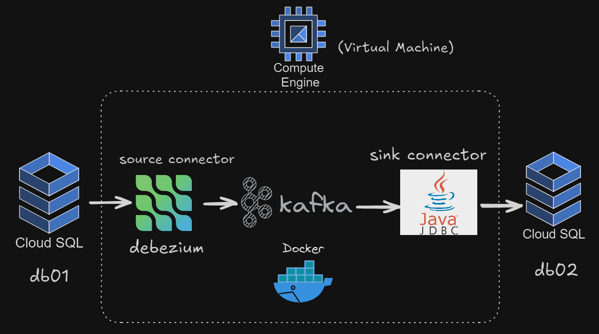
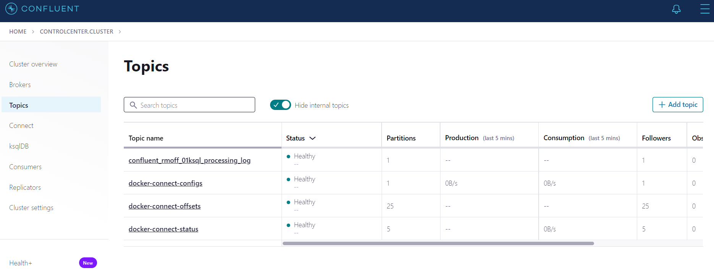

<h1> CDC_kafka (change data capture)</h1> 
<p>
   <br>
  - Using Kafka, a distributed streaming platform, to monitor and capture changes in data from a database(db01) and replicate those changes to another database(db02).<br>
  - Deploy Kafka on Docker in a virtual machine, using Debezium as the source connector and Java JDBC as the sink connector. <br>
</p>
<p>
   <br>
  cloud sql instance <br>
   <br>
  VM (virsual machine) <br>
</p>
<h4>-Authorized networks for connecting to cloudsql : go to connections->Networking->add the VM's external IP address , local IP</h4> 
<h4>-Edit firewall rules </h4>
<p>
   <br>
</p>

<h2> VM </h2>
<h4> Update the package list </h4> 
<pre><code> sudo apt update </code></pre>

#### Install Git on VM
```bash
sudo apt install git
```
#### Install Docker on VM
```bash
curl -fsSL https://get.docker.com | sh
```
```bash
sudo usermod -aG docker $USER
```
```bash
newgrp docker
```
#### Verify Docker Installation and Test 
```bash
docker --version
```
```bash
docker run hello-world
```
#### Check Disk Space
```bash
df -h
```
<h4> Start all services on VM </h4> 
<pre><code>git clone https://github.com/Kittisak008B/CDC_kafka.git
cd CDC_kafka/
docker compose up -d
docker ps -a</code></pre>

- Zookeeper: Manages Kafka brokers.
- Kafka Broker: stores, distributes, and replicates messages between producers and consumers in a Kafka cluster
- Schema Registry: Manages the schemas of messages in Kafka, ensuring compatibility between producers and consumers
- Kafka Connect: Moves data between Kafka and other systems, used here for Change Data Capture (CDC)
- Control Center: Web UI for managing and monitoring Kafka.
- ksqlDB: SQL engine for stream processing.
  
<p>
  go to [VM's_external_IP_address]:9021 
   <br>
</p>

### mysql-source.json
```
{
  "name": "mysql-source-kafka",
  "config": {
    "connector.class": "io.debezium.connector.mysql.MySqlConnector",
    "database.hostname": "[PUBLIC_IP_ADDRESS]",
    "database.port": "3306",
    "database.user": "[USER]",
    "database.password": "[PASSWORD]",
    "database.server.name": "[INSTANCE_ID]",
    "table.whitelist": "[DATABASE_NAME].[TABLE_NAME]",
    "database.history.kafka.bootstrap.servers": "broker:9092",
    "database.history.kafka.topic": "[TABLE_NAME]",
    "decimal.handling.mode": "double",
    "include.schema.changes": "true",
    "key.converter": "io.confluent.connect.avro.AvroConverter",
    "value.converter": "io.confluent.connect.avro.AvroConverter",
    "key.converter.schema.registry.url": "http://schema-registry:8081",
    "value.converter.schema.registry.url": "http://schema-registry:8081"
  }
}
```
#### add source connector
```bash
curl -i -X POST -H "Accept: application/json" -H "Content-Type: application/json" http://localhost:8083/connectors/ -d @mysql-source.json
```
<p>
   <br>
  Received 3 new topics <br>
   <br>
</p>

### mysql-sink-kafka.json
```
{
    "name": "mysql-sink-kafka",
    "config": {
      "connector.class": "io.confluent.connect.jdbc.JdbcSinkConnector",
      "task.max": "1",
      "topics": "", #sink มาจาก topicอะไร
      "key.converter": "io.confluent.connect.avro.AvroConverter",
      "value.converter": "io.confluent.connect.avro.AvroConverter",
      "key.converter.schema.registry.url": "http://schema-registry:8081",
      "value.converter.schema.registry.url": "http://schema-registry:8081",
      "transforms": "unwrap",
      "transforms.unwrap.type": "io.debezium.transforms.ExtractNewRecordState",
      "transforms.unwrap.drop.tombstones": "false",
      "key.converter.schemas.enable": "true",
      "errors.tolerance": "all",
      "errors.log.include.messages": true,
      "connection.attempts": "6",
      "connection.backoff.ms": "1000",
      "connection.url": "jdbc:mysql://[PUBLIC_IP_ADDRESS]:3306/[DATABASE_NAME]?nullCatalogMeansCurrent=true&autoReconnect=true&useSSL=false",
      "connection.user": "[USER]",
      "connection.password": "[PASSWORD]",
      "dialect.name": "MySqlDatabaseDialect",
      "insert.mode": "upsert",
      "delete.enabled" : "true",
      "batch.size": "2",
      "table.name.format": "[TABLE_NAME]",
      "table.whitelist": "[DATABASE_NAME].[TABLE_NAME]",
      "pk.mode": "record_key",
      "pk.fields": "[PRIMARY_KEY]",
      "auto.create": "true",
      "auto.evolve": "true",
      "db.timezone": "Asia/Bangkok"
    }
  }
```
#### add sink connector
```bash
curl -i -X POST -H "Accept: application/json" -H "Content-Type: application/json" http://localhost:8083/connectors/ -d @mysql-sink-kafka.json
```
<p>
   <br>
</p>

<h2> Test change data capture between two databases </h2>
<p>
   <br>
   <br>
   <br>
   <br>
   <br>
   <br>
   <br>
   <br>
   <br>
</p>

#### execute a command in a running container
```bash
docker exec -it connect bash
```
$`ls -lrt /usr/share/confluent-hub-components` <br>
$`exit`

#### find file
```bash
ls -lrt -R | grep "mysql-connector-java-8.0.13.jar"
```
#### check container log
```bash
docker logs [CONTAINER_NAME]
docker logs connect | grep mysql-sink-kafka
```
#### Stop , delete containers , delete volumes with database data and download images
```bash
docker compose down --volumes --rmi all
```
## Reference
https://github.com/nuttatunc/kafka-r2de-demo
